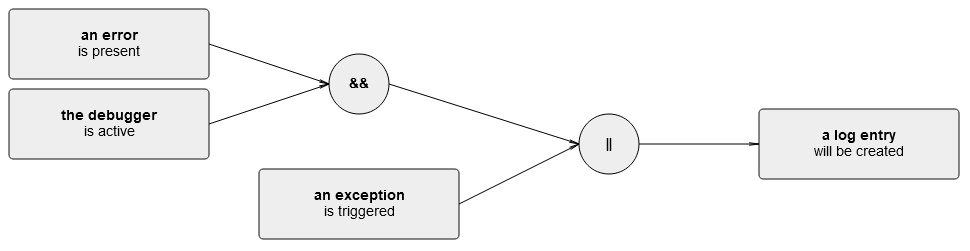

# CiRA Pipeline

[](./LICENSE)
[](https://zenodo.org/badge/latestdoi/456568427)
[](https://github.com/JulianFrattini/cira/actions/workflows/pytest.yml)

## Summary of Artifact

This repostitory contains a Python implementation of the functions around the [causality in requirements artifacts (CiRA) initiative](http://www.cira.bth.se/). The initiative is centered around the notion of causal requirements and causality extraction for automatic test case generation. 

### Features

The main pipeline offers the following functionality:

1. Classifying a sentence regarding its causality (binary classification: causal/non-causal)
2. Labeling the elements of a causal relationship within a causal sentence.
3. Transforming a labeled sentence into a cause-effect graph representing the causal relationship.
4. Transforming a cause-effect graph into a minimal set of test cases (test suite) asserting the behavior implied by the sentence.

### Example

The features can be visualized considering the following example sentence:

> If an error is present and the debugger is active or an exception is triggered then a log entry will be created.

#### 1. Classification

This contrived requirement represents a causal relationship between four events, hence the binary classifier will classify it as `causal`. 

#### 2. Labeling

Labeling the sentence will produce a list of labels that can be visualized as follows (visualization using [labviz](https://github.com/JulianFrattini/labviz)):


Every label consists of a *type* (e.g., `Cause1`, `Variable`), and a *begin* and *end* index, representing the characters it spans across. These labels make explicit, which role each part of the sentence takes in the causal relationship. 

#### 3. Graph Construction

Based on these labels, the causal relationship can be reconstructed in the form of a cause-effect graph (visualization using [labviz](https://github.com/JulianFrattini/labviz)):



The cause-effect graph represents the causal relationship implied by the natural language sentence, but is much easier to process. 

#### 4. Test Case Generation

A minimal set of test cases covering the requirement can be derived from this cause-effect graph:

| id | an exception | an error | the debugger | **a log entry** |
|---|---|---|---|---|
| 1 | is triggered | not is present | is active | will be created |
| 2 | is triggered | is present | not is active | will be created |
| 3 | not is triggered | is present | is active | will be created |
| 4 | not is triggered | not is present | is active | not will be created |
| 5 | not is triggered | is present | not is active | not will be created |

The first three columns after the index represent the input values and the last column represents the expected outcome. These five test cases completely cover the requirement from a combinatorial standpoint.

## Development

### Setup

#### Local Development

This package is built and tested using [Python 3.10.0](https://www.python.org/downloads/release/python-3100/). To use the CiRA pipeline locally, perform the following steps:

1. Make sure the [Rust compiler](https://www.rust-lang.org/tools/install) is installed on your system, as the `tokenizer` package depends on it.
2. Install all required dependencies via `pip3 install -e ".[dev]"` or `pip3 install -e .` if you only want production dependencies.
3. Download and unzip the pre-trained [classification and labeling models](https://doi.org/10.5281/zenodo.7186287) or use the `download-models.sh` script.
4. Create a `.env` file and specify the variables `MODEL_CLASSIFICATION` and `MODEL_LABELING` with the location of the respective models.

You can use the following command to create a default `.env` file that targets the model files that were downloaded with the `download-models.sh` script:

```sh
cat <<EOT >> .env         
MODEL_LABELING=model/cira-labeler.ckpt
MODEL_CLASSIFICATION=model/cira-classifier.bin
EOT
```

#### Development inside a Docker Container

You can develop inside a Docker container using a [pre-build image](https://github.com/JulianFrattini/cira/pkgs/container/cira-dev) that contains all dependencies and the recommended classification and labeling models.

For this setup, you need

1. [Docker](https://www.docker.com)
2. [Visual Studio Code](https://code.visualstudio.com)
3. [Remote Development Extension Pack](https://marketplace.visualstudio.com/items?itemName=ms-vscode-remote.vscode-remote-extensionpack)

Use then the `Remote-Containers: Open Workspace in Container...` command to open the project inside the container.

You can find detailed information about the development container setup [here](https://code.visualstudio.com/docs/remote/containers).

### Usage

To use the CiRA pipeline, instantiate a `src.cira.CiRAConverter` object and specify the location of the pre-trained models. Then, use the high-level functionality as shown in the [demonstration.ipynb](./demonstration.ipynb) file.

## Dockerization

### REST API

The CiRA functionality can also be provided by a single Docker container based on `Dockerfile`.
Build and run the Docker container via `docker compose up`.
CiRA's functionality can then be accessed at `localhost:8080`.
Check `localhost:8080\docs` while the container is running to access the specification of the API.

### Base image cira-dev

The application Docker image and the development container setup are based on the `cira-dev` image and is present in this repository's [packages section](https://github.com/JulianFrattini?tab=packages&repo_name=cira).

## Tests

Run all tests via `pytest`.

## License

Copyright © 2023 Julian Frattini

This work (source code) is licensed under  [Apache License Version 2.0](./LICENSE).
